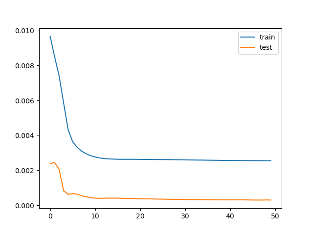

# Ocean Swell Predictor

Michael Crockett

A Long Short-Term Memory (LSTM) neural network that tests whether it's
possible to acurately predict ocean swell given data about the
current sea-water conditions and historical data.

## Datasets

- For various data about the state of New-England seawater, I used data
gathered by the Ocean Observatories Initiative's [Coastal Pioneer New
England Shelf Array](https://dataexplorer.oceanobservatories.org/#ooi/array/CP/node/CP02PMCI-RI/data).
- For historical swell data, I used UCSD's Coastal Data Information
  Program's [station in Jeffery's Ledge, NH](https://cdip.ucsd.edu/themes/?d2=p70:s:160&regions=all&units=standard&zoom=auto&pub_set=public&tz=UTC&ll_fmt=dm&numcolorbands=10&palette=cdip_classic&high=6.096).

## The Algorithm

I decided to use an LSTM algorithm because of its ability to hold on
to important data long-term, which seemed relevant to this task.
Furthermore, it is overall very similar to the recurrent algorithms
studied in class.
You pretty much just add a cell state (with all of its complexity).

## References

I used the following resources to understand LSTMs
- https://machinelearningmodels.org/understanding-long-short-term-memory-lstm-in-machine-learning/
- https://www.geeksforgeeks.org/deep-learning-introduction-to-long-short-term-memory/

I used the following tutorials created by Jason Brownlee to learn how to 
implement an LSTM in python. I specifically wanted to practice using the 
industry-standard tools and libraries. 

- https://machinelearningmastery.com/convert-time-series-supervised-learning-problem-python/
- https://machinelearningmastery.com/multivariate-time-series-forecasting-lstms-keras/

- My code is very similar to that of the tutorials by the nature of 
following a tutorial. I did my best to demonstrate with python comments that I took the time to really understand why each step was done and what
it was accomplishing. I played around with the code where it made sense
to do so, and learned a lot from the process.

I used the following resource in an attempt to calm down what looked to be gradient explosion in my original set-up.

- https://www.geeksforgeeks.org/understanding-gradient-clipping/

## Development Process

### Preparing the Data

About half the time I spent working on this project was dedicated to
preparing the data. The swell data was perfecly nice to work with, but
it turns out that the Ocean Observatory Initiative (OOI) data was
borderline pathological:
- Each parameter for each array had to be downloaded as a separate CSV
- Sensors would randomly go dark for inconvenient blocks of time
- The formatting was unsurprisingly different than the swell data.

In an attempt to cause the least confusion to the model, I decided
to pick the largest, most consistent block of time I could find to
train and test the model.

I used various bash commands and python scripts to clean up and
standardize the data. Various iterations of that process and the
python scrips are included in this directory if you're at all curious.

### Writing and Testing the Code

I largely referenced Jason Brownlee's tutorials for implementing an LSTM
in Python. I updated the parameters and the network to match the data I
was working with, but the general logical flow of the program is not mine. That said, I worked hard to understand each of the libraries 
that are introduced and the reasoning behind each line of code.

I tested and refined the code mostly with trial and error, using
different activation functions, learning rates, loss functions, and 
gradient clipping methods.

## Findings

Reference the [sample output](./swell_predictor.out) from training.

My goal was to see if I could predict the swell for two days given
the current non-swell seawater conditions. The testing data for the
orange line is the two days after the end of the training data.
The model was mostly successful, which means all of those seemingly
unrelated data points can, in fact, say something about swell.

To further back up that conclusion, I ran the model without water
velocity as an input, and it was still successful.

## What I learned

By using an LSTM, I reinforced my studies of recurrent neural networks.

With this specific implementation, I learned a lot about what it might
look like to work with real-world messy data and trying to fit that
into a model that expects pretty, consistent data. I imagine random
blackouts of sensor data aren't that uncommon in the field.

On the programming side, I got to learn and practice with some Python
libraries I've been meaning to work with for a long time. In particular,
learning how to work with Pandas dataframes and new numpy functions
and practices was very enriching for me. I'm always excited to see and
work with the amazing tools people create.